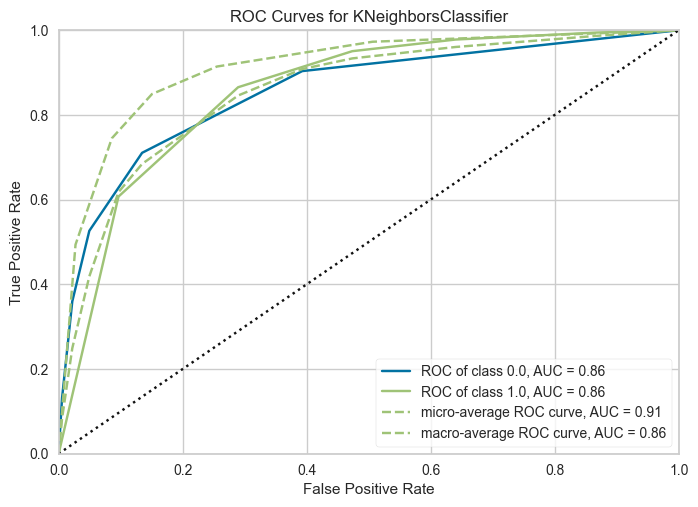
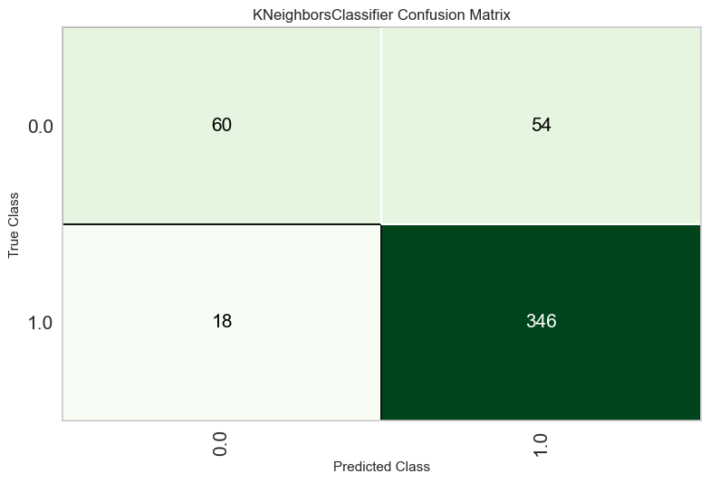
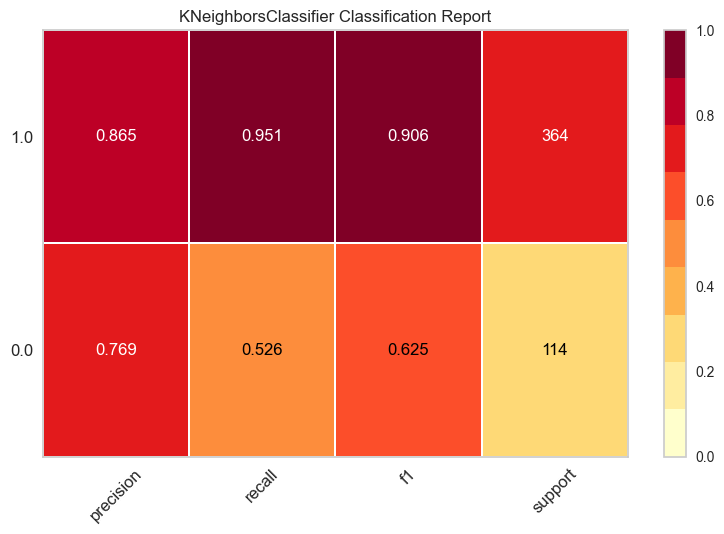
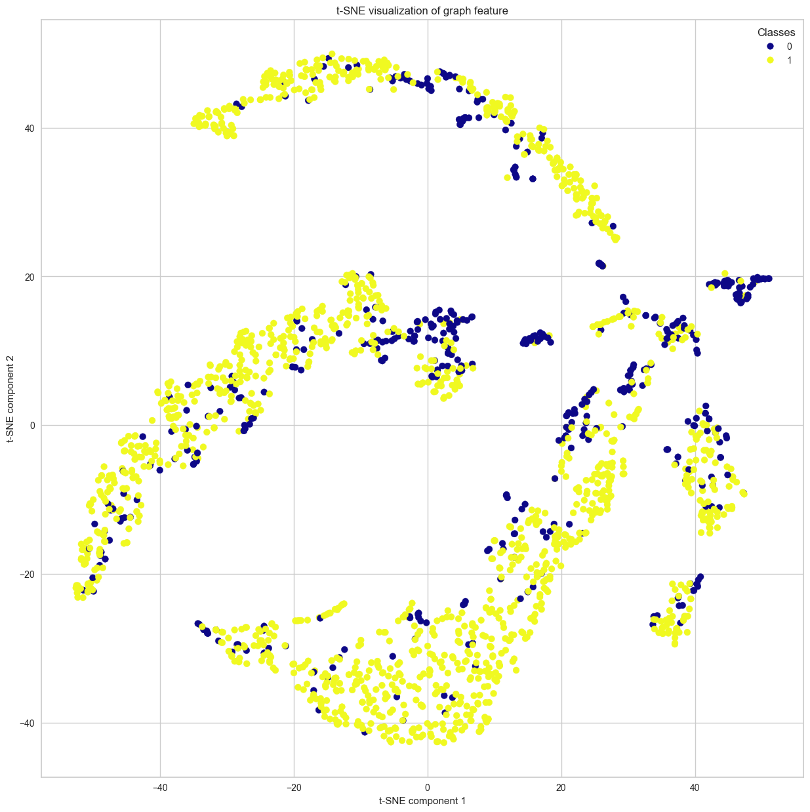

# Predicting BBBP Using Graph Mining

**Jinho Seo**  
202321973  
kkinho04@catholic.ac.kr

## Introduction

### Background

Blood-Brain Barrier Penetration (BBBP) is a crucial factor in drug development. BBBP refers to the ability of a drug or chemical to pass through the blood-brain barrier and enter the brain. Because BBBP greatly influences the efficacy and safety of drugs, predicting it is of paramount importance.

Chemical molecules have complex structures, and these structural features are closely related to BBBP. Traditional chemical information may not adequately reflect these structural features, so analyzing graph data can be effective. In this project, we convert chemical molecules into graphs and build a model to predict BBBP using graph embeddings.

### Objective

The primary goal of this project is to convert the structure of chemical molecules into graphs and develop a model that predicts BBBP using graph embedding techniques. Specifically, we aim to:
1. Convert the SMILES strings of chemical molecules into NetworkX graphs.
2. Use the Node2Vec algorithm to learn node embeddings and generate graph embeddings.
3. Build a machine learning model that predicts BBBP using the generated graph embeddings.
4. Visualize the high-dimensional feature vectors using T-SNE to analyze the structural properties of the data.

## Methodology

### Data Preparation and Graph Construction

#### Data Loading

The BBBP dataset provides molecular structures in SMILES (Simplified Molecular Input Line Entry System) format along with the BBBP status of each molecule. We load this data from a CSV file using Pandas and extract the necessary information.

```python
bbbp_df = pd.read_csv("BBBP.csv")
```

#### Converting SMILES to Molecular Objects

SMILES is a string notation that represents the structure of chemical molecules. Using the RDKit library, we convert these SMILES strings into molecular objects. RDKit is a specialized tool for handling chemical structures and is used to analyze the structural information of molecules.

```python
mol = Chem.MolFromSmiles(smiles_string)
```

#### Converting Molecular Objects to NetworkX Graphs

We use the NetworkX library to represent the converted molecular objects as graphs. Each atom becomes a node in the graph, and bonds between atoms become edges. Additionally, each node is assigned chemical attributes such as atomic number and hybridization state to reflect the molecule's properties.

```python
graph = mol_to_nx(mol)
```

```python
def mol_to_nx(mol):
    G = nx.Graph()

    for atom in mol.GetAtoms():
        G.add_node(atom.GetIdx(),
                   labels=atom.GetSymbol(),
                   atomic_num=atom.GetAtomicNum(),
                   formal_charge=atom.GetFormalCharge(),
                   chiral_tag=atom.GetChiralTag(),
                   hybridization=atom.GetHybridization(),
                   num_explicit_hs=atom.GetNumExplicitHs(),
                   is_aromatic=atom.GetIsAromatic())
    for bond in mol.GetBonds():
        G.add_edge(bond.GetBeginAtomIdx(),
                   bond.GetEndAtomIdx(),
                   bond_type=bond.GetBondType(),
                   bond_type_value=bond.GetBondTypeAsDouble())
    return G
```

#### Storing Graphs and Labels

We store the converted graphs and labels in a dictionary called `bbbp_dict`. This dictionary has molecule names as keys and graphs and labels as values.

```python
bbbp_dict[name]["graph"] = graph
bbbp_dict[name]["label"] = label
```

### Graph Feature Extraction and Node2Vec Embedding


#### Graph Feature Extraction

We extract significant chemical properties from each graph to generate graph feature vectors. These properties provide useful information when embedding the graph's structural characteristics. Key properties include the number of nodes, the number of edges, and the average degree.

```python
def extract_features(graph: nx.Graph):
    features = {}
    
    features["num_nodes"] = graph.number_of_nodes()
    features["num_edges"] = graph.number_of_edges()
    
    features["average_bond_type"] = sum(nx.get_edge_attributes(graph, "bond_type").values()) / len(graph.nodes)
    features["num_aromatic_atoms"] = sum(1 for _, d in graph.nodes(data=True) if d.get("is_aromatic", False))
    features["num_carbons"] = sum(1 for _, d in graph.nodes(data=True) if d.get("labels") == "C")
    features["num_oxygens"] = sum(1 for _, d in graph.nodes(data=True) if d.get("labels") == "O")
    
    return features.values()
```

#### Node2Vec Embedding

Node2Vec is a random walk-based graph embedding algorithm that maps the structural characteristics of a graph into a vector space. Each node is represented as a unique vector, and these vectors capture the graph's structural patterns.

```python
device = 'cuda' if torch.cuda.is_available() else 'cpu'

model = Node2Vec(
    graph_batch.edge_index,
    embedding_dim=14,
    walk_length=10,
    context_size=5,
    walks_per_node=10,
    num_negative_samples=1,
    p=1.0,
    q=1.0,
    sparse=True,
).to(device)

loader = model.loader(batch_size=128, shuffle=True)
optimizer = torch.optim.SparseAdam(list(model.parameters()), lr=0.01)


def train():
    model.train()
    total_loss = 0
    for pos_rw, neg_rw in loader:
        optimizer.zero_grad()
        loss = model.loss(pos_rw.to(device), neg_rw.to(device))
        loss.backward()
        optimizer.step()
        total_loss += loss.item()
    return total_loss / len(loader)


@torch.no_grad()
def test():
    model.eval()
    z = model()
    acc = model.test(
        train_z=z[data.train_mask],
        train_y=data.y[data.train_mask],
        test_z=z[data.test_mask],
        test_y=data.y[data.test_mask],
        max_iter=150,
    )
    return acc


for epoch in range(1, 30):
    loss = train()
    print(f'Epoch: {epoch:03d}, Loss: {loss:.4f}')
```

We obtain the embeddings of each node from the trained Node2Vec model and perform average pooling to create a graph-level feature vector.

```python
graph_avg_pool = gnn.global_mean_pool(graph_batch.x, graph_batch.batch, graph_batch.batch_size)
```

#### Creating Graph Feature Vectors

We generate embedding vectors for each graph and combine them with `feature_vec` to create a comprehensive feature vector for the graph.

```python
graph_feature = torch.concat([graph_avg_pool, feature_vec], dim=1)
```

### Predicting BBBP

#### Data Splitting

Using the generated graph feature vectors and labels, we split the data into training and testing sets. This allows us to evaluate the performance of the model.

```python
X_train, X_test, y_train, y_test = train_test_split(graph_feature, torch.tensor(graph_batch.y).unsqueeze(1), test_size=0.2, random_state=42, stratify=graph_batch.y)
```

#### Model Setup and Training

We use the PyCaret library to set up various classification models and compare their performance to select the best model. PyCaret simplifies the process of setting up and comparing multiple machine learning models.

```python
exp = setup(train_df, target="20")
best_model = compare_models()
```

#### Model Tuning

To further optimize the performance of the selected model, we use PyCaret's `tune_model` function to tune the model. During the tuning process, hyperparameters are automatically adjusted to maximize the model's performance.

```python
tuned_model = tune_model(best_model)
```
We compare the performance of the model before and after tuning to confirm if the tuned model improves prediction performance.

```python
plot_model(best_model, plot='auc')  # Pre-tuning
plot_model(tuned_model, plot='auc')  # Post-tuning
```

#### Model Evaluation and Prediction

We evaluate the performance of the tuned model using metrics such as AUC (Area Under Curve), confusion matrix, and classification report. These metrics help us understand the model's predictive capabilities intuitively.

```python
plot_model(tuned_model, plot='confusion_matrix')
plot_model(tuned_model, plot='class_report')
```

Finally, we use the trained model to make predictions on the test data and analyze the results.

```python
predictions = predict_model(tuned_model)
```

#### Model Performance Comparison

The following table shows the comparison of model performance based on Accuracy:

| Model | Accuracy | AUC | Recall | Prec. | F1 | Kappa | MCC | TT (Sec) |
| --- | --- | --- | --- | --- | --- | --- | --- | --- |
| K Neighbors Classifier | 0.8313 | 0.7837 | 0.9411 | 0.8532 | 0.8947 | 0.4751 | 0.4921 | 0.0060 |
| Random Forest Classifier | 0.8250 | 0.8310 | 0.9623 | 0.8338 | 0.8933 | 0.4200 | 0.4568 | 0.0850 |
| Logistic Regression | 0.8233 | 0.7937 | 0.9564 | 0.8353 | 0.8917 | 0.4225 | 0.4545 | 0.0140 |
| Linear Discriminant Analysis | 0.8224 | 0.7956 | 0.9611 | 0

.8318 | 0.8917 | 0.4111 | 0.4493 | 0.0050 |
| Gradient Boosting Classifier | 0.8214 | 0.8186 | 0.9398 | 0.8437 | 0.8891 | 0.4378 | 0.4557 | 0.1490 |
| Ridge Classifier | 0.8206 | 0.7957 | 0.9729 | 0.8234 | 0.8919 | 0.3844 | 0.4380 | 0.0050 |
| Extra Trees Classifier | 0.8089 | 0.8415 | 0.9658 | 0.8170 | 0.8850 | 0.3406 | 0.3908 | 0.0350 |
| Light Gradient Boosting Machine | 0.8071 | 0.8102 | 0.9327 | 0.8339 | 0.8804 | 0.3889 | 0.4072 | 0.0660 |
| Quadratic Discriminant Analysis | 0.8008 | 0.7422 | 0.9374 | 0.8251 | 0.8773 | 0.3555 | 0.3827 | 0.0050 |
| Ada Boost Classifier | 0.7981 | 0.7783 | 0.9233 | 0.8305 | 0.8743 | 0.3663 | 0.3824 | 0.0440 |
| Naive Bayes | 0.7703 | 0.6792 | 0.9174 | 0.8075 | 0.8588 | 0.2558 | 0.2719 | 0.0050 |
| Dummy Classifier | 0.7612 | 0.5000 | 1.0000 | 0.7612 | 0.8644 | 0.0000 | 0.0000 | 0.0050 |
| SVM - Linear Kernel | 0.7541 | 0.7297 | 0.8972 | 0.8134 | 0.8423 | 0.1923 | 0.2308 | 0.0060 |
| Decision Tree Classifier | 0.7523 | 0.6490 | 0.8467 | 0.8317 | 0.8386 | 0.3027 | 0.3047 | 0.0070 |

As shown in the table, the K Neighbors Classifier (KNN) recorded the highest Accuracy. 

| Fold | Accuracy | AUC | Recall | Prec. | F1 | Kappa | MCC |
| --- | --- | --- | --- | --- | --- | --- | --- |
| 0 | 0.8036 | 0.8257 | 0.9647 | 0.8119 | 0.8817 | 0.3271 | 0.3751 |
| 1 | 0.7768 | 0.7320 | 0.9176 | 0.8125 | 0.8619 | 0.2915 | 0.3068 |
| 2 | 0.8125 | 0.7756 | 0.9412 | 0.8333 | 0.8840 | 0.4049 | 0.4261 |
| 3 | 0.8036 | 0.6671 | 0.9412 | 0.8247 | 0.8791 | 0.3672 | 0.3913 |
| 4 | 0.8198 | 0.7879 | 0.9286 | 0.8478 | 0.8864 | 0.4559 | 0.4671 |
| 5 | 0.8559 | 0.7623 | 0.9524 | 0.8696 | 0.9091 | 0.5647 | 0.5786 |
| 6 | 0.8829 | 0.8016 | 0.9647 | 0.8913 | 0.9266 | 0.6399 | 0.6523 |
| 7 | 0.8739 | 0.8482 | 0.9529 | 0.8901 | 0.9205 | 0.6178 | 0.6263 |
| 8 | 0.7748 | 0.8296 | 0.8706 | 0.8409 | 0.8555 | 0.3460 | 0.3471 |
| 9 | 0.8739 | 0.8437 | 0.9765 | 0.8737 | 0.9222 | 0.5943 | 0.6209 |

| Model | Accuracy | AUC | Recall | Prec. | F1 | Kappa | MCC |
| --- | --- | --- | --- | --- | --- | --- | --- |
| K Neighbors Classifier | 0.8719 | 0.8357 | 0.9637 | 0.8795 | 0.9197 | 0.6062 | 0.6220 |







In the cross-validation results, the K Neighbors Classifier (KNN) had the highest average Accuracy. Therefore, the KNN model also showed superior performance on the test data.

## Visualization

### Visualization with T-SNE

T-SNE (t-Distributed Stochastic Neighbor Embedding) is a technique for visualizing high-dimensional data in a low-dimensional space. We use T-SNE to convert high-dimensional graph embedding vectors into 2D and plot them to visually analyze the structural properties of the data.

```python
import matplotlib.pyplot as plt
from sklearn.manifold import TSNE

tsne = TSNE(n_components=2)
X_tsne = tsne.fit_transform(graph_feature)

plt.figure(figsize=(15, 15))
scatter = plt.scatter(X_tsne[:, 0], X_tsne[:, 1], c=graph_batch.y, cmap='plasma', s=50)
plt.legend(handles=scatter.legend_elements()[0], labels=[0, 1], title="Classes")
plt.title("t-SNE visualization of graph feature")
plt.xlabel("t-SNE component 1")
plt.ylabel("t-SNE component 2")
plt.grid(True)
plt.show()
```



## Results and Discussion

### Graph Construction Results

The process of converting chemical molecules into NetworkX graphs was successful, and we were able to reflect the chemical properties of the molecules in the graph, including the attributes of each atom and bond. This graph representation proved very useful for analyzing the structural features of the molecules.

### Node2Vec Embedding Results

Using the Node2Vec model, we successfully learned the embeddings for each node and generated graph-level feature vectors. The learned embeddings effectively captured the structural characteristics of the graphs, and the average pooling provided a comprehensive feature vector representing each graph.

### BBBP Prediction Results

By using PyCaret, we were able to compare various classification models, select the best model, and improve its performance through tuning. The results before and after tuning are as follows:

1. **Pre-tuning Model Performance**: The initial evaluation of the selected model showed high accuracy in predicting BBBP status.
2. **Post-tuning Model Performance**: After tuning, the model's accuracy and AUC were further improved, indicating the importance of hyperparameter optimization in enhancing prediction performance.

The comparison of performance before and after tuning showed that the tuned model improved in sensitivity and specificity. The analysis of the confusion matrix and AUC demonstrated that the tuned model outperformed the pre-tuned model, highlighting the importance of hyperparameter tuning.

### Visualization Results

The visualization results using T-SNE showed that the high-dimensional graph embedding vectors were well-distributed by class in the 2D space. This suggests that the embedding vectors effectively capture features that distinguish BBBP status. Visualization helped us clearly understand the boundaries and structural distribution between the classes.

## Conclusion

In this project, we developed a model to predict the BBBP status of chemical molecules using graph embeddings. By converting SMILES strings into graphs and learning node embeddings through the Node2Vec algorithm, we were able to effectively represent the structural features of the graphs. Using PyCaret, we compared various classification models and selected the best model, achieving high accuracy in predictions.

Model tuning significantly enhanced performance, demonstrating the critical role of hyperparameter optimization. Visualization with T-SNE showed that the graph embedding vectors effectively distinguished BBBP status.

Future research should explore more diverse graph embedding methods and seek ways to further improve the model's predictive performance. This will provide more valuable insights into drug development and chemical research.
